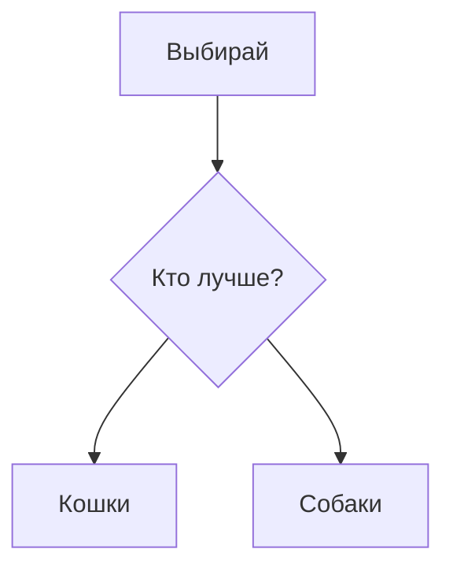

# **Самые редкие породы кошек в мире**
-------------------------------------
## **Самая редкая порода кошек**
### ***Выяснить, какая из пород домашних кошек является самой редкой из всех, практически невозможно: никто не в состоянии подсчитать точное количество всех особей той или иной породы, даже если их не так много. Некоторые фелинологические организации (например, CFA — международная ассоциация любителей кошек) составляют ежегодные рейтинги популярности пород (по количеству регистраций новых представителей в течение года), но и эта информация не считается абсолютно достоверной, так как в другой федерации цифры могут быть иными. Поэтому всевозможные рейтинги и топы самых редких и самых популярных котов являются предметом бесконечных споров среди профессиональных заводчиков и простых любителей животных***
~~```Родина этой редкой породы кошек — Таиланд. Там их издавна считают символами удачи и достатка и даже дарят в качестве свадебных подарков. За пределами королевства эти питомцы с пепельно-серой шерстью и глазами оливково-зеленого оттенка встречаются нечасто, поэтому высоко ценятся.```~~

- **Редкие породы домашних кошек**
  - ` *Далеко не все редкие породы кошек признаны официально. Парадокс в том, что получить официальный статус им не позволяет как раз малая численность особей и низкая распространенность. Но это не останавливает их поклонников, которые месяцами и даже годами ждут эксклюзивных котят в очереди и выкладывают за них немалые деньги.* `
- [x] Редкая кошка
- [ ] Кошка со двора
- [ ] Обычная кошка
- ### **Американская жесткошерстная**
  - #### *Эта порода кошек появилась в США в 1960-х годах, когда в помете обычных американских короткошерстных родился котенок с жесткой шерстью, похожей на тонкие железные пружины. Мутировавший ген, который и стал причиной столь необычного шерстного покрова, оказался доминантным, что сделало проще дальнейшую селекцию. Но, несмотря на свою более чем 60-летнюю историю, эти питомцы так и не получили широкого распространения, и за пределами США найти их очень трудно.*
- ## **Тойгер**


[С подсказкой](https://lh7-us.googleusercontent.com/78kPEO0BnQI0pEndaZI5K6cmvUczMB7DXfQ2uS91wK6QHPAE9ZsOnXT_cvWYwDl4rOC6N_zFxDL5pV0VxmM8IMdt87HB8_p9tjZRZjU_dYXAMQGfriMY41weNw8XHHN47M0pvvZ9Vd0nqKElPKawdT0 "При наведении")
### *В этих «игрушечных тиграх» (от англ. toy — игрушка и tiger — тигр) экзотическая и яркая внешность, напоминающая экстерьер дикой кошки, отлично сочетается с дружелюбным и веселым характером. Они коммуникабельны, но ненавязчивы, обожают быть в центре внимания, легко находят общий язык со всеми членами семьи, в том числе детьми и другими домашними животными.*
# История происхождения
- Порода тойгер была выведена в 1980-х годах в Америке, ее создателем стала Джуди Сагден. Примечательно, что матерью заводчицы была Джин Милл, основатель породы бенгальских кошек. Джуди решила вывести породу, которая внешне напоминала бы тигра, но оставалась бы доброй, ласковой и уравновешенной. Для этого она скрестила бенгальских котов и короткошерстных кошек с выразительным полосатым окрасом.

- В 1993 году породу внесли в реестр международной фелинологической организации TICA (The International Cat Association). А в 2007 году тойгеры получили официальное признание и смогли участвовать в конкурсах и выставках.
- >Сегодня тойгеры остаются эксклюзивной породой. Они встречаются преимущественно у себя на родине, в США
  > >Тойгер — кошка среднего размера с атлетичным телом и ярким полосатым рисунком на шерсти. Внешне представители породы действительно напоминают миниатюрных тигров, это особенно заметно в плавных и грациозных движениях.
  > >Средний вес тойгера колеблется в пределах от 4 до 7 кг, рост составляет 30–40 см. Самцы, как правило, выглядят крупнее самок.

- ## **Корат**

### *Родина этой редкой породы кошек — Таиланд. Там их издавна считают символами удачи и достатка и даже дарят в качестве свадебных подарков. За пределами королевства эти питомцы с пепельно-серой шерстью и глазами оливково-зеленого оттенка встречаются нечасто, поэтому высоко ценятся.*

- ## **Кхао-мани**


[Ссылочный стиль][1]

[1]: https://lh7-us.googleusercontent.com/sWEZTMh-kg4fVWxOkgEypRp1dT12cOGVycobqTCPBeVxBagILpq1MNNbChyXdO5QsBSFMv2S5Mv5NJSGMyKNcw_pbsoBPz_TiahmsE69Zex6J6K41bNUVWSHHet8CkOPQL4XHcaLoItJS2GEKqz_XG8
### *Еще одна тайская порода, которая долго считалась собственностью королевской семьи, и даже вывоз ее из Таиланда был запрещен. В переводе с местного языка «кхао мани» означает «белый драгоценный камень»: такое название отлично подходит этим стройным кошкам с блестящей белоснежной шерстью и глазами разных оттенков (чаще всего — желтого и голубого).*
# Что такое кошка?
>  Домашнее млекопитающее из семейства кошачьих (научное название Felis catus), хищник, который часто живёт рядом с человеком. Кошки отлично охотятся (например, на грызунов), у них развиты слух, зрение и ловкость.
> > Как питомец — одно из самых популярных животных-компаньонов: они могут быть ласковыми, независимыми, игривыми, а ещё умеют успокаивать своим мурчанием.В мире существует множество пород — от пушистых персидских до бесшёрстных сфинксов.
> > > В языке и культуре — образ кошки встречается в пословицах («Ночью все кошки серы»), сказках («Кошкин дом» Маршака), приметах и даже в театре (например, Театр кошек Юрия Куклачёва).

# `А что будет если нажать на нос кошке?....`

[](https://img.magnific.com/premium-photo/cute-scottish-fold-cat-is-sitting-by-table-with-laptop-indoors_146671-85527.jpg?semt=ais_hybrid&w=740) <-- тык
#### Кратко об информации:
|Порода|Живут|
|-----:|:--------:|
|Корат   |Таиланд |  
|Тойгер  |США     | 
|Кхао-мани|Таиланд|  



